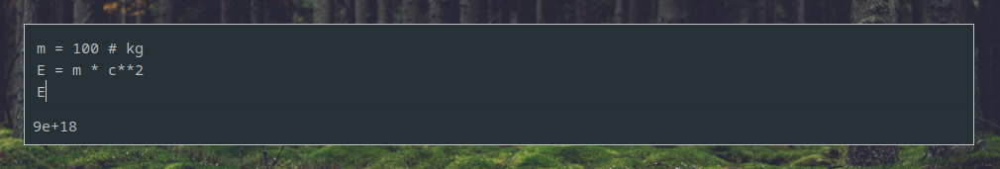
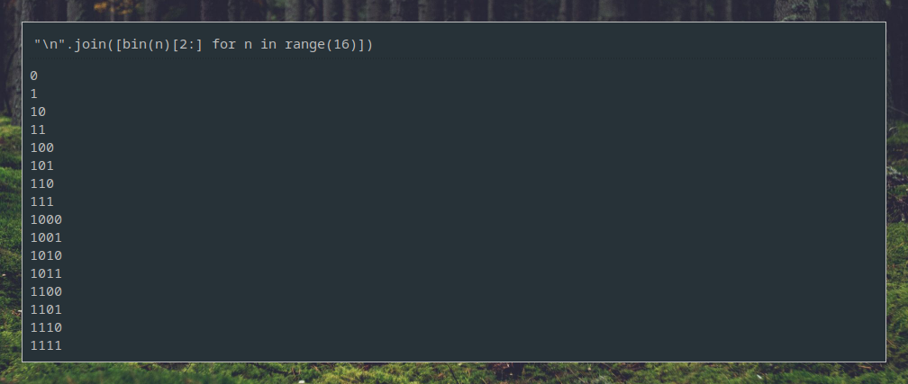

# Popysh - POpup PYthon SHell

Just a quick script to allow you to type out python expressions at the tap of a button.

## Installation

`main.py` is a single file executable script - put it wherever you normally put your scripts. Renaming is recommended.

### Dependencies

- PyQt5
- pyperclip (clipboard support)

Run `pip install -r requirements.txt` to automatically install.

## Usage

For best results, use your window manager or utility of choice to bind a key combination to run the script. When run, you can type in the text box and the result of the expression will be displayed below in real time. Only the result of the very last line is displayed. The previous lines are run as statements, so you can put variable assignments etc. on previous lines just like you would in a normal program.

The alt-up/down arrows work quite similarly to when you're in a terminal accessing previous commands. You can scroll through previously executed programs using alt-up and alt-down, but when you modify a historical program it is added to the end of history as normal instead of modifying the program at the previous point in the history. You can also alt-down all the way to the bottom which will create a new blank program at the very end of the history.

## Configuration

At the top of the file is defined a list of constants. Add any constants you feel are useful (or, even better, open an issue or PR to suggest they're added by default!). The style can be changed using the QSS string found near the top of the program.

## Keybinds

- Ctrl-C (no text selected) - copy result to the clipboard
- Ctrl-C (text selected) - copy selected text from the code to the clipboard
- Ctrl-S - Save the script to a file
- Esc - Quit
- Alt-UpArrow - load the previous value from history
- Alt-DownArrow - load the next value from history

## TODO

- [x] Also save code to a file?
- [ ] Show autocomplete options?
- [ ] Add themes, built in and external
- [x] Make multi-line programs properly work
- [x] Figure out the weird bug with list comprehensions
- [ ] Syntax highlighting
- [ ] Custom library for mathematical functions - equation solving etc.
- [ ] Fix not being able to overwrite constants e.g. c in code
- [ ] When the expression is blank/nonexistant, return None rather than a syntax error
- [x] Save and load history
